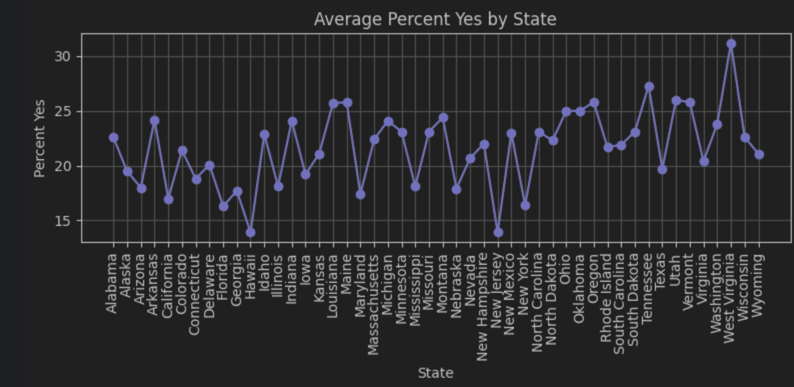
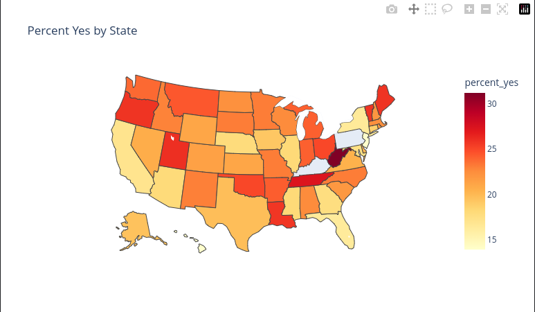
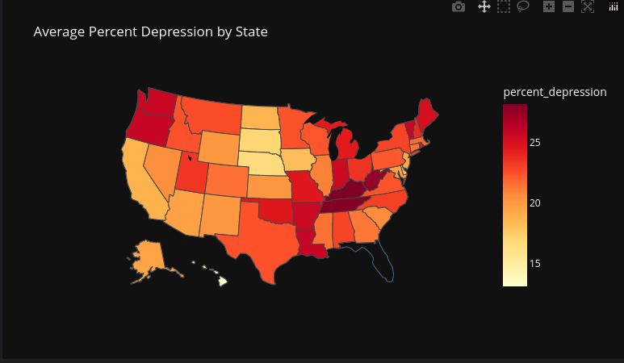

# Data Science: Data Analysis and Storytelling

## Jason, Nadir, Anthony, Derrick

# Dataset 1

This bar chart shows the average percentage of people reporting depression symptoms in each state, revealing a clear rise from low-rate coastal states to high-rate Southern and Appalachian states.

This line graph visualizes state-by-state depression rates and highlights fluctuations across the U.S., with the highest values concentrated in the South and Appalachia.

This histogram shows how state depression percentages are distributed, with most states clustering between roughly 20% and 25%.

This map displays depression rates geographically, showing the South and Appalachian regions in darker shades to indicate higher levels of depression.

# Dataset 2 

This bar chart ranks states by their average reported depression rates, again showing the lowest rates in states like Hawaii and the highest in Southern and Appalachian states.

This line graph shows the same depression-rate trend in a continuous format, underscoring the consistent pattern of lower rates in the West/Northeast and higher rates in the South/Appalachia.

This histogram shows how the percentage of people experiencing depression is distributed across observations, with most values clustered around 20–25 percent.

This map of the United States illustrates the average percentage of depression in each state, with darker colors representing higher percentages.

# What question are you exploring? 
Is there a correlation between what state you live in and a person's depression rate? 

# What did you find? 
In dataset 1, the lowest depression rate is around 13% and 15%, with the lowest ones being Hawaii, New Jersey, New York, California, and Maryland. The highest rates appear in states such as Tennessee, Kentucky, West Virginia, Arkansas, Oklahoma, and Alabama, which show noticeably elevated levels of depression.

Dataset 2 confirms these findings, reinforcing that the Southern and Appalachian regions have the highest depression rates. The states with the lowest rates in dataset 1 also rank at the bottom in dataset 2, strengthening the overall pattern.

Both datasets indicate that states with the highest depression rates tend to have lower median incomes, higher poverty levels, and higher unemployment rates. Many of these states also have limited access to mental health resources, often requiring residents to travel greater distances to reach clinics or qualified providers. Additionally, these areas experience higher rates of chronic health issues, such as diabetes, heart disease, chronic pain, and obesity, which are strongly linked to an increased risk of depression.

Overall, the data suggest a connection between depression rates, economic conditions, healthcare access, and community well-being. These factors vary widely by state and region, rather than being randomly distributed across the United States, and appear to be interconnected. 

# Why does it matter?

Identifying the rates of depression could be vital to understanding how large-scale environmental factors can contribute to a person's mental health. It must be explored how their mental health could contribute to their behaviors and their likelihood to do either positive or negative things. Gathering and understanding the data is a powerful tool that would allow us as a society to send more resources to areas with high rates of depression, and that would help those suffering from depression. It would also allow us to study how making those changes to the environment and those large-scale factors affect the states with the highest rates of depression. Investing in the infrastructure of those states and even changing the current infrastructure would likely allow those who are depressed to become better.
